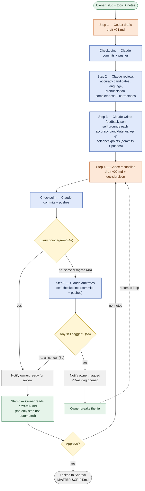

# Coverage Desk — Script-Stage Pipeline Spec

Design spec for the first automated stage of video production: script writing. Draft → review → ground → feedback → reconcile → arbitrate → finalize or flag. Git-backed twin of the working Artifact; update both together.

Status: **Phase 2 proven on a real episode.** `pipeline/run-pipeline.sh` ran a real "Life of a Packet" episode end to end (with a live timeout fix along the way — see section 10). Step 6 owner review caught a new house rule (5-minute length cap, now permanent pipeline behavior) plus acronym-expansion and title-bookend gaps; Codex's revision pass fixed all three, and the result is locked at `Projects/Life-of-a-Packet-Automated/Shared/LIFE-OF-A-PACKET-AUTOMATED-MASTER-SCRIPT.md`. See "Owner decision" below for why this exists despite the business-before-tools gate in `PROJECT-CONTEXT.md` still being open. See section 9 for Phase 1's hand-run findings and section 10 for Phase 2's build and first real run.

## 1. Owner decision — proceeding ahead of the business gate

`PROJECT-CONTEXT.md`'s business-before-tools gate blocks automation until niche validation, competitor analysis, packaging demand, and revenue economics are done — and as of 2026-08-29 the niche is still undecided. Logged here rather than edited into that document: the owner decided to proceed with Coverage Desk scaffolding anyway, treating this as pipeline tooling prep rather than full production automation. The gate itself is unchanged and still governs channel launch, subscriptions, and full video production.

## 2. The steps

| Step | Role | What happens | In → out |
|---|---|---|---|
| 1 | Codex | Drafts the script from topic + notes | topic, notes → draft v1 |
| 2 | Claude | Reviews for accuracy + language | draft v1 → review notes |
| 2.5 | Antigravity | Grounds each accuracy claim against live search | candidate claims → verdict + source |
| 3 | Claude | Writes itemized feedback | review notes + grounding → feedback.json |
| 4 | Codex | Reconciles feedback point by point (4a agree/revise, 4b disagree + reason) | feedback.json → draft v2 + decision.json |
| — | auto | If every point was 4a, skip straight to Step 6 — no second review pass | — |
| 5 | Claude | Arbitrates any 4b disagreement (5a concur, 5b still disagrees) | decision.json → concur or flag |
| — | owner | Breaks the tie on a 5b flag; that decision resumes the loop | — |
| 6 | Owner | Final read of the reconciled script (draft v2, or later if arbitration looped) — the last human checkpoint before locking | draft v2 → locked script in `Shared/`, or notes sent back into the loop |



Full prompt text for each step lives in `pipeline/prompts/`. JSON contracts: `pipeline/schemas/feedback.schema.json`, `pipeline/schemas/decision.schema.json`.

**Why Step 6 exists even on a clean all-agree run:** Steps 1-5 can auto-finalize on two AI models agreeing with each other, but agreement isn't the same bar as "an actual person would find this good." `PROJECT-CONTEXT.md` bets the channel's differentiation on real narrative judgment, not just factual accuracy — so the script gets one human read before it locks, regardless of how clean the automated loop was. At roughly 2,200 words for a 13-scene script, that's a 10-20 minute read, not a bottleneck. Claude does a mechanical proofread pass (typos, formatting, dropped words) immediately before handing off, so the owner's read is spent on judgment and tone, not copy-editing.

**Direct-edit review (idea for later, not built yet):** Step 6 currently means the owner reads the file and tells Claude go/no-go in chat. The better version: the owner edits `draft-vNN.md` directly in their own editor — no copy-pasting change requests into chat — then tells Claude they're done. Claude diffs the file against the version it handed off to see exactly what changed, and that edited version (not a chat description of it) is what gets locked into `Shared/`. This is already possible today in its basic form (it's a real file in the repo; nothing stops an editor-direct edit right now), so this note is really about formalizing it as Step 6's default mode in Phase 2 rather than something that needs new tooling — e.g. deciding whether Claude should proactively diff on "I'm done" versus the owner explicitly flagging what changed, and whether an owner-edited script skips back through Steps 2-4 for a re-check or is trusted as final once a human touched it directly.

## 3. Why grounding is Step 2.5, not part of Step 5

Codex and Claude agreeing on a claim is not the same as the claim being true — both can be confidently wrong about the same fact. Step 2.5 checks accuracy claims against live search before they ever become official feedback, so "both models agree" stops being the only bar a fact has to clear. Runs on Antigravity CLI (`agy`), verified headless with no API key; Gemini via Vertex AI is the fallback if rate limits or reliability become an issue, billed against the existing $1,000 Vertex budget.

## 4. Tools — verified headless, no API keys

All three CLIs run on subscription/OAuth login, not metered API keys — status as of the Phase 1 hand-run (see section 9 for the live findings):

- **Codex CLI** (`codex exec`) — requires `--skip-git-repo-check` outside a trusted/git-repo directory; not needed once run from inside this repo. Also defaults to a **read-only sandbox**; writing the draft file needs `-s workspace-write`. Confirmed working headless.
- **Claude Code** (`claude -p`) — headless mode is permission-gated by default; checkpoint calls need `--allowedTools "Bash,Read,Edit"`, not the bare `claude -p` form, **and the prompt must be piped via stdin, not passed positionally after `--allowedTools`** (see section 9). **Not currently authenticated for headless use** — `claude -p` returns "Not logged in" even from a plain terminal, contradicting this section's original claim. Needs `claude setup-token` (or interactive `/login`) before Step 2/3/5 can run.
- **Antigravity CLI** (`agy -p`) — successor to Gemini CLI, which sunset for free/consumer use. Installer left the binary off PATH; add `~/.local/bin` to the shell profile if `agy: command not found` shows up again. Not yet exercised in the Phase 1 hand-run — Step 2.5 hasn't been reached.

## 5. Ownership — Claude is the sole GitHub operator, and owns all software work

One writer, always — not Codex, not a separate script wrapper. Wherever Claude is already running a step (review, feedback, arbitration), staging/committing/pushing rides along in that same call. Wherever Codex or Antigravity produced a step's output, one small additional Claude call does the checkpoint afterward: look at what changed, write the commit message, push.

This extends past GitHub: anything that counts as code, automation, or pipeline plumbing — the orchestrator script, prompt templates, wrapper code — goes through Claude specifically, never Codex. Codex's job is confined to the script's actual words (drafting in Step 1, reconciling in Step 4).

Checking whether a PR has been merged is a mechanical status check (`gh pr view <n> --json state`), not a judgment call — the orchestrator does that directly rather than spending a Claude call on it.

**PR-as-flag (idea for later, not built yet):** a Step 5b flag could become an actual pull request — the contested line as the diff, both agents' reasoning as PR comments, the owner's merge as the decision that resumes the loop.

## 6. Storage — GitHub for text, Google Drive for media

Already the repo's own rule (`PRODUCTION-STRUCTURE.md`), not a new one: GitHub stores plans, scripts, prompts, code, and small thumbnails; Google Drive stores heavy media (MP4/WAV drafts, frame exports, final renders, large source assets). Coverage Desk's script-stage files — drafts, feedback, decisions — are text, so they stay git-only.

```
Faceless-Youtube/
├── COVERAGE-DESK-SPEC.md      ← this file
├── pipeline/                  ← shared machinery, one copy for every episode
│   ├── prompts/
│   │   ├── 01-codex-draft.md
│   │   ├── 02-claude-review.md
│   │   ├── 02.5-antigravity-ground.md
│   │   ├── 04-codex-reconcile.md
│   │   └── 05-claude-arbitrate.md
│   ├── pipeline.yaml
│   ├── run-pipeline.sh
│   └── schemas/
│       ├── feedback.schema.json
│       └── decision.schema.json
└── Projects/
    └── <video-slug>/
        ├── Codex/              ← draft-v01.md, draft-v02.md, disagreement reasons
        ├── Claude/             ← review notes, feedback.json, decision.json
        ├── Shared/             ← the locked, finalized script
        └── Production/         ← downstream of the script, unaffected by this spec
```

Auth lives outside the repo entirely (`~/.codex`, `~/.claude`, `~/.gemini`); `.gitignore` is a backstop, not the control. `gh auth login` covers both `git push` and future `gh pr` commands. Losing the Mac means reinstalling and logging back in everywhere — never restoring a secret from a backup.

## 7. Known doc conflict — not yet resolved

**Resolved.** `END-TO-END-WORKFLOW.md` had Claude drafting the script end-to-end with Gemini/OpenAI as the independent auditor — Codex wasn't in that document at all. Fixed to reflect the actual confirmed design (Codex drafts, Claude reviews/reconciles, then the Gemini/OpenAI audit runs on the pipeline's finalized output) before Phase 2 build work started.

## 8. Project plan

| Phase | Owner | What |
|---|---|---|
| 0 | Claude | Scaffold `pipeline/` and this file into the repo. One commit, nothing runs. |
| 1 | Owner | Hand-run the flow once on a real topic, calling each CLI directly, to prove the prompt wording and JSON shape before anything runs unattended. |
| 2 | Claude | ✅ Built. `pipeline/run-pipeline.sh` sequences the CLI calls, parses JSON between steps, branches on 4a/4b, checkpoints to git. See section 10 for what changed from the Phase 1 design along the way. |
| 3 | Owner | First unattended run end to end — confirm it either auto-finalizes or flags, and that the push notification actually arrives. |
| 4 | Claude | Harden: retries/timeouts around headless CLI calls, clearer errors, a switch to Vertex if Antigravity's free tier gets rate-limited. |
| later | — | Extend the same shape (draft → review → ground → feedback → reconcile → arbitrate) to voiceover, editing, and thumbnails. Not scheduled. |

## 9. Phase 1 findings log

Live notes from the first hand-run, topic: *"The Life of a Packet — What Actually Happens on the Network When Your AI Agent Does a Task"* (episode folder: `Projects/Life-of-a-Packet/`). Grounded in the owner's own Cisco Live 2026 (Las Vegas) session on this topic. Updated as each step is actually run — this is the evidence Phase 2's orchestrator gets built from, not a prediction of it.

**Step 1 (Codex draft) — done.** `codex exec --skip-git-repo-check -s workspace-write "<prompt>"` produced `Projects/Life-of-a-Packet/Codex/draft-v01.md` (13 scenes, ~2,500 words) on the second attempt. First attempt failed silently on the write — Codex's sandbox defaults to read-only, so `-s workspace-write` is required, not optional. Codex also self-corrected a claim from the owner's own notes ("every agent is its own IP endpoint" isn't quite right — agents typically share a host IP; NAT/PAT tracks per-flow state, not per-agent identity) rather than repeating it uncritically, which is the behavior the spec's uncertainty rule is meant to produce.

**Step 2 (Claude review) — done, after an auth fix.** Two issues surfaced, in order:

1. `claude -p --allowedTools "Bash,Read,Edit" "<prompt>"` fails: `--allowedTools` greedily consumes the next argv as more comma-separated tool rules instead of treating it as the prompt, so the prompt text gets shredded into garbage permission rules and `claude -p` then errors with no prompt provided. **Fix:** pipe the prompt via stdin instead of passing it positionally — `cat prompt.md | claude -p --allowedTools "Bash,Read,Edit"`.
2. With that fixed, `claude -p` returned `Not logged in · Please run /login` — reproduced both from inside a Claude Code session's Bash tool and from a plain Terminal window (`echo hi | claude -p`), so this wasn't a nested-session artifact. This section's earlier claim that `claude -p` was "confirmed working headless on this Mac" was stale/wrong. **Fix:** `claude setup-token` (headless-appropriate, unlike interactive browser `/login`) generates a token, but does not itself write it anywhere — it must be manually exported (`export CLAUDE_CODE_OAUTH_TOKEN="..."` in `~/.bash_profile`) for `claude -p` to pick it up. Once that was done, `claude -p` authenticated correctly.

With auth fixed, Step 2 produced real review notes: 9 accuracy candidates for grounding, plus language notes that caught a genuine house-style conflict (see below) and a continuity error (Scene 1 sets up "an AI engineer," Scene 13's original closer called back to "the architect" instead).

**Step 2.5 (Antigravity grounding) — done, sampled not exhaustive.** `agy -p "<prompt>"` authenticated and worked on the first try, no flags needed beyond `-p`. Rather than ground all 9 accuracy candidates (real cost at scale), 3 were run as a proof sample — all came back `supported` with real, checkable sources (RFC 4271 for BGP policy routing; Palo Alto/OWASP docs for certificate pinning vs. TLS inspection; RFC 3022/2663 for NAT/PAT per-flow state). The cert-pinning grounding also surfaced a useful precision nuance (pinning "prevents" inspection by aborting the handshake, not by silently routing around it) without actually contradicting the claim — a good example of grounding doing more than a binary supported/contradicted check.

**Step 3 (Claude writes feedback.json) — done, but exposed a scaffolding gap.** There is no `pipeline/prompts/03-claude-feedback.md` file — Phase 0's file tree (section 6) never included one. Worked around it by writing the Step 3 prompt inline for this run; a real `03-claude-feedback.md` should be added before Phase 2. Output validated cleanly against `feedback.schema.json` (15 points, correct enums, correct `grounded` sub-objects) on the first attempt — no schema-shape surprises.

**Step 4 (Codex reconciles) — done, auto-finalized.** All 15 feedback points resolved `agree`; `decision.json` validated cleanly and covered every `feedback_id` from `feedback.json` with none dropped. Codex correctly applied both the house-style fix (removed the first-person "I spoke at Cisco Live 2026" framing per an explicit owner decision — see below) and the continuity fix. Because every point was `agree`, Step 5 (arbitration) was correctly skipped per the pipeline's own auto-finalize rule.

**Owner decision folded into Step 3, not sent to grounding:** the draft's first-person "I have spent years in networking" / "my Cisco Live 2026 session" framing conflicted with `PROJECT-CONTEXT.md`'s "do not use the owner's voice" rule. The owner confirmed the Cisco Live material is real but was given to the pipeline only to establish the topic is well-grounded, not as an instruction to write the narrator as the owner's literal identity. This was the right kind of point to resolve as an owner policy decision rather than an Antigravity grounding candidate — grounding answers "is this true," not "should we say this."

**New Step 6 added to the design (section 2): owner final read before locking to `Shared/`.** The steps table originally had Steps 1-5 auto-finalizing straight to a locked script with no human read on the clean-agreement path — only a 5b flag pulled the owner in. Added because two AI models agreeing isn't the same bar as "a person would find this good," and `PROJECT-CONTEXT.md` bets the channel's differentiation on real narrative judgment. At ~2,200 words for 13 scenes, this is a 10-20 minute read, not a bottleneck.

**Pronunciation-note completeness — real gap, now fixed both in this draft and in the process.** During the Step 6 read, `draft-v02.md` was scanned for every abbreviation used and cross-checked against existing `Pronunciation notes` blocks. `RAG` had zero guidance despite being exactly the ambiguous case this matters for — it's conventionally spoken as a word ("rag") in AI/ML, not spelled out, and a TTS engine has no way to know that without an explicit note. `TCP`, `UDP`, `IP`, `ISP`, and `URL` were also missing notes despite sibling abbreviations in the same scenes (`TLS`, `QUIC`, `DHCP`/`NAT`/`PAT`, `DNS`/`BGP`) already having them. Fixed directly in `draft-v02.md`, and added a permanent "pronunciation completeness" check to `pipeline/prompts/02-claude-review.md`'s Step 2 instructions so future episodes catch this automatically instead of relying on a manual scan at Step 6.

**Pronunciation correctness, not just completeness — a second real gap found during the same read.** The owner (real networking background) caught that Scene 5's grouped note — `"DHCP, NAT, PAT: say each letter"` — was wrong for two of its three entries: `NAT` and `PAT` are conventionally pronounced as words in networking ("nat," "pat"), not spelled out. Only `DHCP` is genuinely letter-by-letter. The grouping is exactly what let the error hide. Fixed in the draft, and extended the Step 2 review prompt to check correctness (letter-vs-word, verified per abbreviation) in addition to completeness — checking each entry individually even inside an existing group, and sending genuinely uncertain cases to Step 2.5 grounding rather than guessing.

**Two technical accuracy flaws caught at Step 6 — DNS resolution placed in the wrong part of the network.** Scene 7 (and Scene 13's recap of it) described DNS resolution as happening after the request "enters an ISP" — implying it's a deep-network event. It isn't: resolution happens close to the device, via a local/enterprise resolver or one handed out by DHCP, before the request goes anywhere near ISP-core routing. Notably, Scene 3 already had this right ("resolving DNS... is not time spent crossing the internet"), so Scenes 5-7's placement also contradicted the script's own Scene 3. Fixed by moving the DNS-resolution explanation into Scene 5 (alongside DHCP, which typically hands out the resolver address too), leaving Scene 7 with a callback plus its still-valid BGP/interdomain-routing content, and correcting Scene 13's summary line to match. This is exactly the kind of flaw Step 6 exists to catch — both AI reviewers (Claude at Step 2, Codex at Step 4) missed it; only the owner's actual domain expertise found it.

**Result: this draft is versioned `v03`**, one step past what Step 4 produced, to keep the automated Step 1-4 output (`draft-v02.md`) distinct from the owner's Step 6 corrections. Locked into `Projects/Life-of-a-Packet/Shared/LIFE-OF-A-PACKET-MASTER-SCRIPT.md` — matching the naming precedent actually used in `Projects/AI-Agent-Map/Shared/` (`<SLUG>-MASTER-SCRIPT.md`) rather than `PRODUCTION-STRUCTURE.md`'s documented-but-unused `video-slug_asset-type_v01_short-note.ext` pattern, since the real precedent should win over the stale doc. **Phase 1 is complete.**

## 10. Phase 2 build notes

`pipeline/run-pipeline.sh` is now a real orchestrator, not the placeholder. What changed from the Phase 1 design along the way:

**Tooling**: neither `jq` nor `yq` was installed on this Mac (only `python3`) — installed both via Homebrew (`yq` here is the Go/mikefarah build, `.path` syntax, not the Python one that wraps `jq`), plus `coreutils` for `gtimeout` — macOS's BSD userland has no `timeout` at all, and every CLI call in this pipeline needed one to avoid an unattended run hanging forever.

**Step 2.5 collapsed into Step 3, not bash.** Rather than force Step 2's freeform review notes into structured JSON just so bash could loop over accuracy candidates and shell out to `agy -p` itself, Step 3's `claude -p` call (already given Bash access to write `feedback.json`) grounds each candidate itself — reading Step 2's notes, deciding what's worth checking, invoking `agy -p` per claim, then writing the fully-grounded file. `pipeline/prompts/03-claude-feedback.md` was rewritten accordingly. From bash's side, Steps 2.5 and 3 are just: capture Step 2's stdout to a file → feed it into one Step 3 call → read back `feedback.json`.

**Git checkpointing follows section 5's existing design, not a new invention**: a new `pipeline/prompts/checkpoint.md` handles the small dedicated Claude call that commits+pushes after each Codex step (1 and 4); Claude's own steps (2 producing no file, 3, 5) checkpoint inline within their own turn — Step 5's prompt already documented this and needed no change there; Step 3's prompt gained explicit checkpoint instructions since it didn't have any before.

**`pipeline/prompts/04-codex-reconcile.md` was too terse to run unattended** — the version used in Phase 1's actual hand-run had substantially more detail (explicit schema references, output paths, guidance on grounded-vs-ungrounded points) filled in ad hoc at the time. Rewritten to be self-sufficient.

**Notification is bash-level, deterministic, not something a headless `claude -p` call claims to do itself.** `pipeline.yaml`'s `notify.unattended` (was `status: not_built`) is now an `osascript` call inside `run-pipeline.sh`, firing at two points: episode ready for owner review, and a point getting flagged. Step 5's prompt previously implied it sends a push notification itself — corrected, since a headless subprocess can't reliably call an interactive-only tool; it now just makes sure `decision.json` carries everything needed for whatever's driving the run to surface it.

**Found and fixed a real prerequisite that had been sitting open**: section 7's `END-TO-END-WORKFLOW.md` doc conflict (Claude drafting end-to-end, no Codex) was flagged "do this before Phase 2" back in Phase 1 but never actually done. Fixed now — see section 7.

**Bash correctness choices worth remembering**: `local x; x=$(cmd)` always split across two lines, never combined — `set -e` only sees `local`'s own exit status otherwise, silently swallowing a failed `codex`/`claude`/`agy` call. Step 2's raw notes get concatenated into Step 3's prompt via `cat file1 file2 | claude -p`, never string-interpolated — unpredictable AI-generated prose could contain `$`, backticks, or `!` that a shell would happily interpret. Template substitution (topic/notes into Step 1's prompt) uses bash parameter expansion, not `sed`, since `sed`'s replacement string treats `&`/`\1` specially and owner-supplied notes could contain either.

**Still not built, deliberately** (matches the phased project plan, not an oversight): retry logic beyond the `gtimeout` cap, full JSON Schema validation (jq structural checks only — required keys present, arrays non-empty), Step 6 automation (the script stops after notifying; the owner's read/edit/lock-to-`Shared/` stays the Phase 1 manual process), resuming a partial run.

**Verification — smoke test, then a real episode.** A throwaway smoke test (`Test-Pipeline-Smoke`, pushed to a test branch) ran clean end to end first. Self-review before either run caught three real bugs pre-emptively: a trailing-newline gap in `render_prompt` that would have glued two concatenated files together, and two `<slug>`/`{{slug}}` placeholder mismatches (`checkpoint.md`, `05-claude-arbitrate.md`) that would have left Claude unable to find the right episode folder.

**The real run (`Life-of-a-Packet-Automated`, pushed to `main`) hit one live failure**: Step 2's 180s timeout was too tight for this denser topic plus the new pronunciation-correctness scan, and `gtimeout` killed it mid-review. `set -e` correctly stopped the whole run rather than continuing into a corrupted state — `draft-v01.md` was already safely committed. Fixed by bumping every timeout with real headroom based on observed run times, and adding a `--skip-draft` flag so a future hiccup like this resumes from Step 2 instead of redoing completed work. Re-run succeeded fully: 23 feedback points, 8 self-grounded via `agy -p`, all resolved `agree`, auto-finalized.

**Step 6 caught what automation didn't**: same DNS-placement and NAT/PAT-pronunciation classes of bug from Phase 1 did *not* recur (good evidence the process fixes actually transferred) — but the owner's read surfaced three new things: acronyms (`NAT`, `PAT`, `BGP`, `DLP`) pronounced correctly but never defined in narration; the episode's own title/theme never spoken, only in the file header; and a new hard house rule — 5 minutes max for non-entertainment/educational videos (attention span plus external-service cost scaling with runtime) — that this draft blew past by roughly 2x. All three are now permanent: `PROJECT-CONTEXT.md`'s Owner preferences, and Step 1/Step 2's prompts, so future drafts start in budget rather than getting caught here. Codex's revision pass cut `draft-v02.md`'s 1,815 narration words to 695 while keeping all 14 scenes (the owner's explicit direction: trim depth of explanation per scene, not scene count — traceroute's probe/reply mechanics as the calibration example, collapsed to "a traceroute offers clues, not proof"), fixed all three acronym expansions, and bookended the title. Locked at `Projects/Life-of-a-Packet-Automated/Shared/LIFE-OF-A-PACKET-AUTOMATED-MASTER-SCRIPT.md`.

---

*Coverage Desk · script-stage automation spec · git-backed twin of the published Artifact*
